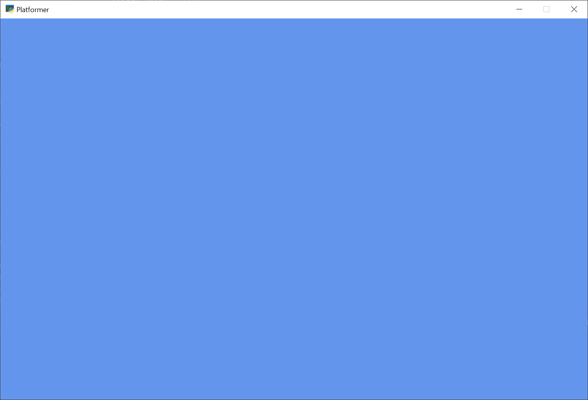

## Paso 1 - Instalar y Abrir una Ventana

Nuestro primer paso es asegurarnos de que todo esté instalado y que, al menos, podamos abrir una ventana.

### Instalación

- Asegúrate de tener Python instalado. [Descarga Python aquí](https://www.python.org/downloads/) si aún no lo tienes.
- Asegúrate de que la [librería Arcade](https://pypi.org/project/arcade/) esté instalada.
  - Primero, debes configurar un entorno virtual (venv) y activarlo.
  - Instala Arcade con el siguiente comando:
    ```bash
    pip install arcade
    ```
  - Aquí tienes la instalación oficial más detallada: *ver sección de instalación*.

### Abrir una Ventana

El ejemplo que se muestra a continuación abre una ventana en blanco. Configura un proyecto y haz que el código que aparece funcione.

> **Nota:**  
> Esta es una ventana de tamaño fijo. Es posible tener una ventana redimensionable o un ejemplo a pantalla completa, pero hay cosas más interesantes que podemos hacer primero. Por ello, nos quedaremos con una ventana de tamaño fijo para este tutorial.

#### Archivo: `01_open_window.py`

```python
import arcade

# Configuración de la ventana
SCREEN_WIDTH = 800
SCREEN_HEIGHT = 600
SCREEN_TITLE = "Ejemplo: Abrir una Ventana"

class MyGame(arcade.Window):
    def __init__(self, width, height, title):
        super().__init__(width, height, title)
        # Configura el color de fondo
        arcade.set_background_color(arcade.color.AMAZON)

    def on_draw(self):
        # Inicia el renderizado
        arcade.start_render()
        # Aquí se podría agregar código para dibujar elementos en la ventana

def main():
    window = MyGame(SCREEN_WIDTH, SCREEN_HEIGHT, SCREEN_TITLE)
    arcade.run()

if __name__ == "__main__":
    main()
```

Deberías obtener una ventana similar a la siguiente:



Una vez que hagas funcionar el código, intenta averiguar cómo ajustar el código para que puedas:

- Cambiar el tamaño de la pantalla (o incluso hacer la ventana redimensionable o a pantalla completa).
- Cambiar el título.
- Cambiar el color de fondo.
  - Consulta la documentación de *color*.
  - Consulta la documentación de *csscolor*.
- Revisa la documentación de la clase `arcade.Window` para tener una idea de todo lo que puede hacer.

### Ejecutar este Capítulo

Para ejecutar este capítulo, utiliza el siguiente comando en la terminal:

```bash
python -m arcade.examples.platform_tutorial.01_open_window
```
