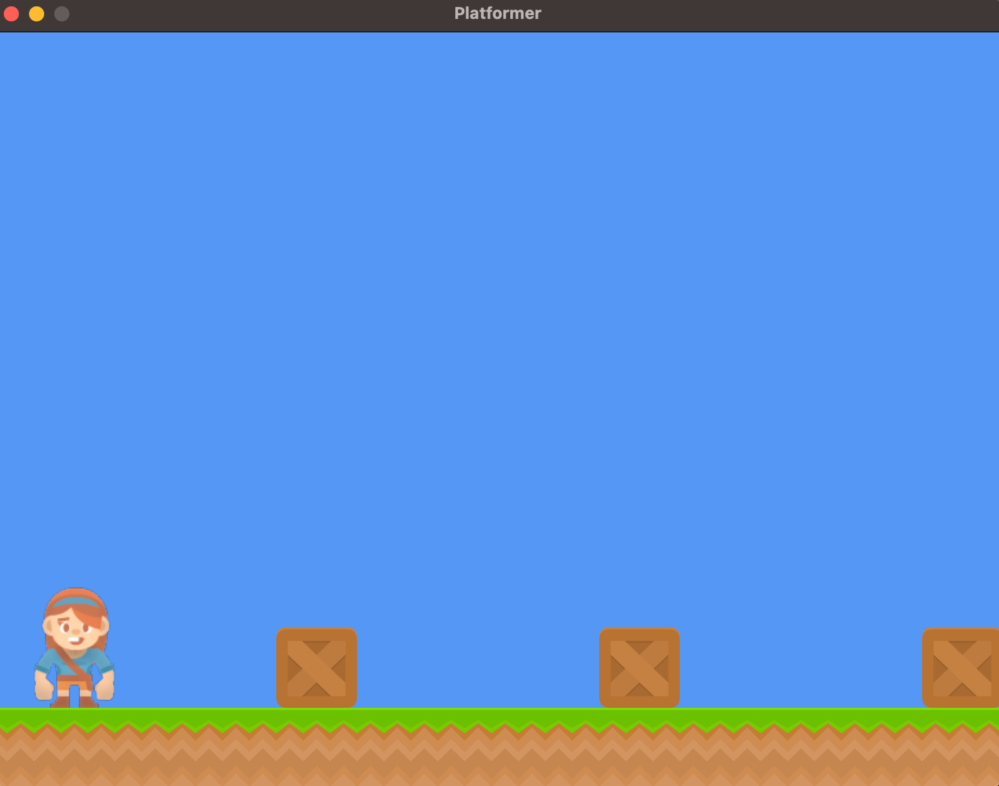

## Paso 3 - Muchos Sprites con SpriteList

Hasta ahora, nuestro juego está tomando forma: ¡ya tenemos un personaje en la pantalla! ¿No sería genial que nuestro personaje tuviera un mundo en el que vivir? Para lograrlo, necesitaremos dibujar muchos más sprites. En este capítulo exploraremos `SpriteList`, una clase que Arcade proporciona para dibujar una gran cantidad de sprites de una sola vez.

Al final del capítulo, obtendremos algo similar a lo siguiente:



### SpriteList

La clase `arcade.SpriteList` existe para dibujar una colección de sprites a la vez. Supongamos, por ejemplo, que tienes 100,000 sprites en forma de cajas que deseas dibujar. Sin `SpriteList`, tendrías que poner todos tus sprites en una lista y luego recorrerla con un bucle `for` que llame a `draw()` en cada sprite.

Este enfoque es extremadamente ineficiente. En su lugar, puedes agregar todas tus cajas a un `arcade.SpriteList` y luego dibujar el SpriteList. Al hacer esto, puedes dibujar los 100,000 sprites con aproximadamente el mismo costo que dibujar un solo sprite.

> **Nota:**  
> Esto se debe a que Arcade es una biblioteca fuertemente basada en la GPU. Las GPUs son muy buenas realizando operaciones en lotes. Esto significa que podemos enviar toda la información de nuestros sprites a la GPU y luego indicarle que los dibuje todos de una vez. Sin embargo, si dibujamos un sprite a la vez, tendríamos que realizar una comunicación entre la CPU y la GPU para cada sprite.

Incluso si solo dibujas un sprite, es recomendable utilizar `SpriteList` para aprovechar estas optimizaciones.

#### Ejemplo de uso de SpriteList

```python
import arcade

SCREEN_WIDTH = 800
SCREEN_HEIGHT = 600
SCREEN_TITLE = "Ejemplo: Muchos Sprites con SpriteList"

class MyGame(arcade.Window):
    def __init__(self, width, height, title):
        super().__init__(width, height, title)
        arcade.set_background_color(arcade.color.AMAZON)

        # Crea un SpriteList
        self.player_list = arcade.SpriteList()
        
        # Carga la textura del jugador y crea un sprite
        player_texture = arcade.load_texture(":resources:images/animated_characters/female_adventurer/femaleAdventurer_idle.png")
        player_sprite = arcade.Sprite()
        player_sprite.texture = player_texture
        player_sprite.center_x = width // 2
        player_sprite.center_y = height // 2

        # Agrega el sprite a la lista
        self.player_list.append(player_sprite)

    def on_draw(self):
        arcade.start_render()
        # Dibuja todos los sprites en la lista
        self.player_list.draw()

def main():
    window = MyGame(SCREEN_WIDTH, SCREEN_HEIGHT, SCREEN_TITLE)
    arcade.run()

if __name__ == "__main__":
    main()
```

Este código crea una `SpriteList`, añade un sprite del personaje a la lista y lo dibuja en la pantalla de forma optimizada.
